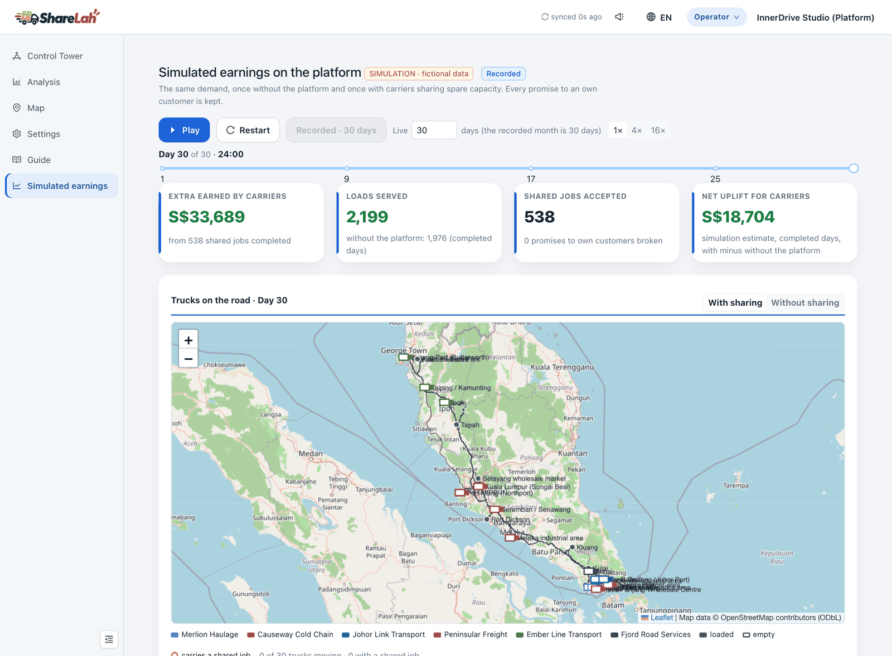
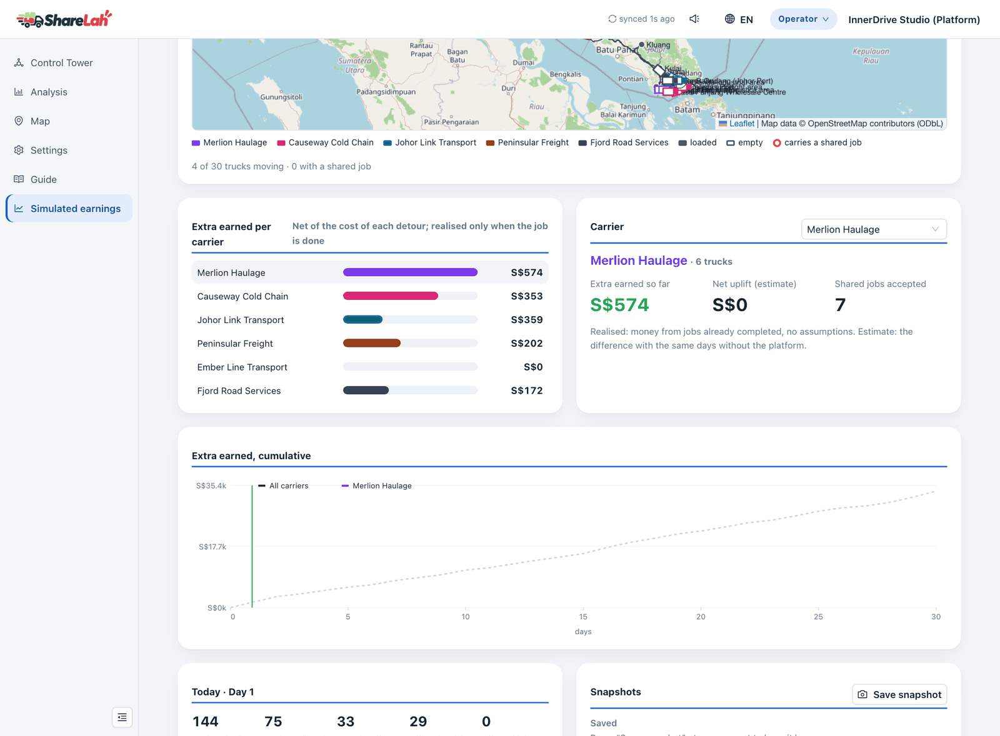
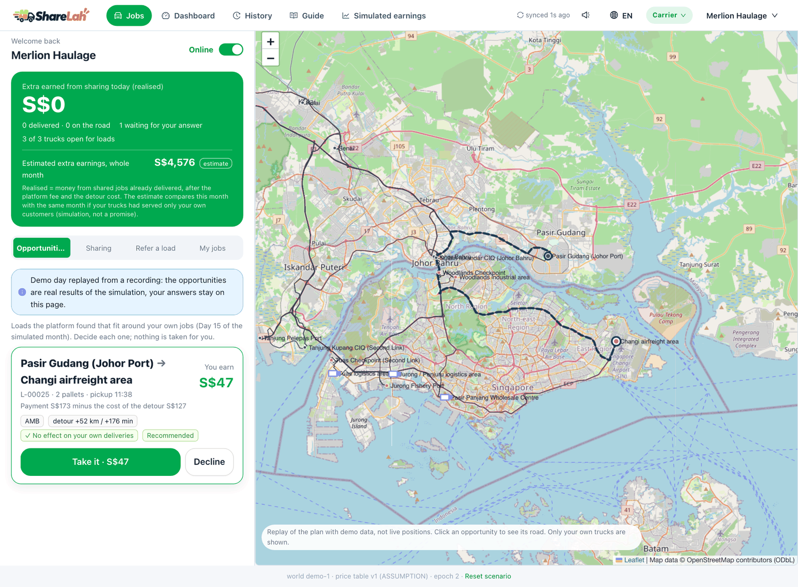
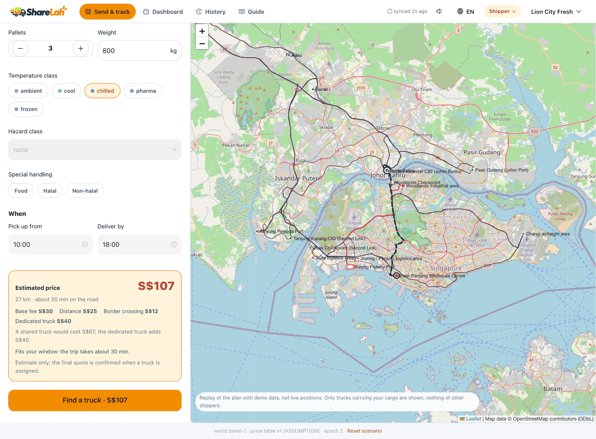
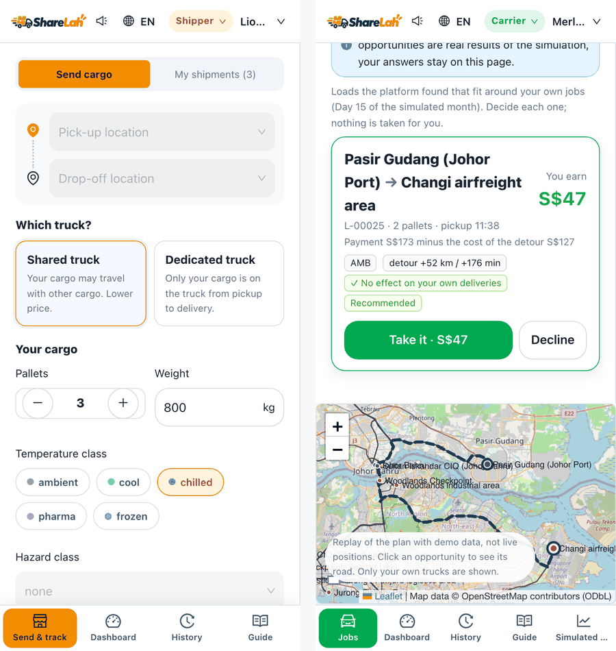

<p align="center"></p>

<p align="center"><b>Shared freight for Singapore and Peninsular Malaysia — carriers share only their spare capacity.</b></p>

<p align="center">
  
  
  
  
  
  
</p>

<p align="center"><b><a href="https://sharelah-demo.innerdrivestudio.com">Live demo →</a></b> &nbsp;·&nbsp; English / 中文 switch at the top right &nbsp;·&nbsp; pick a role (Shipper, Carrier, Operator) at the top</p>

ShareLah is a demo of a **shared freight platform**. A carrier keeps control of its own deliveries and offers only what its trucks do not need. The platform finds loads from other shippers that fit around the carrier's own jobs, shows what each one would add to the carrier's pocket (payment, minus the platform fee, minus the cost of the detour), and **never moves a promise the carrier has made to its own customers**.



> **Fictional data.** The carriers, shippers, loads, prices and costs are generated from stated assumptions; nothing here is real company data. Roads and distances use OpenStreetMap data (© OpenStreetMap contributors, ODbL). Money is in SGD.

---

## What you can do in the demo

Open the live demo and use the role switch at the top: the same world is seen by three people.

| Role | What you see and do |
|---|---|
| **Shipper** | Pick up and drop-off, then choose a **shared** or a **dedicated** truck: the price changes at once and the difference is named. Follow each shipment from *received* to *done* on a map that shows only your own cargo. |
| **Carrier** | See the **opportunities** the platform found for your spare capacity: what you earn, what the detour costs, what it does to your own deliveries. **Take** or **decline** each one. Choose which trucks go into the shared pool, and for how long. You see only your own company. |
| **Operator** | Control Tower with the whole network, the effect of sharing in four scenarios, approval of a load to a truck, and the **Simulated earnings** page: a recorded month, played day by day. |

A new order for a carrier rings and pops up; a shipper hears when the request is sent and when a carrier accepts (one switch mutes it).

### The simulated month

The same demand is run twice, once without the platform and once with carriers sharing spare capacity. The page shows the extra money each carrier earned (realised only when the job is done), loads served, a cumulative curve, daily snapshots, and a map where trucks move along real roads.



### Carrier: opportunities with the money first



### Shipper: a shared or a dedicated truck



### On a phone

<p align="center"></p>

---

## How a load becomes an opportunity

```
carrier's own orders ──► kept first (commitments)
        │
        ▼
 spare capacity offers (whole truck free, or part of it)
        │      + loads posted by other shippers
        ▼
 opportunities: payment − platform fee − cost of the detour = what the carrier earns
        │          (a truck that would earn nothing is never offered the load)
        ▼
 the carrier takes or declines ──► a taken load is locked into the truck's route
        │                          a declined load goes back to the operator
        ▼
 realised earnings, counted only when the job is delivered
```

## What this demonstrates

- **Spare capacity, not a pool.** Carriers offer only what their trucks do not need; their own customers come first, and the demo checks that no promise to them is broken (zero in the recorded month).
- **Money first, and honest.** *Realised* earnings (jobs already delivered) are shown apart from the *estimate* for the month, and the cost of a detour is part of every figure.
- **One price for a load.** The price the shipper sees is the price the load is sold at; the carrier gets that price less the platform fee and less its own detour cost.
- **Each person sees only their part.** A carrier sees its own company; a shipper sees its own cargo; the operator sees everything.
- **Concurrency-safe acceptance.** Taking an opportunity is checked against the version of the offer and of the truck's route, so a stale answer is refused instead of overwriting a change.
- **Product surface.** English and Chinese, alerts with sound, a phone layout, real place names everywhere.

## Engineering Approach

This project uses a contract-first workflow:

1. Define the data contracts (view models and API payloads) before the screens that use them.
2. Keep the UI layer separate from the data and decision logic through a ViewModel-style interface; the screens render what the contract gives them.
3. Preserve the raw simulation output (a recorded run) so every figure on the screen can be reproduced and checked.
4. Use explicit rules before showing anything as decision support: a shared load is never offered if it would break a promise to the carrier's own customers or earn the carrier nothing.
5. Keep the mock backend behind the same contract as a real one, so the demo and a real backend can be swapped without touching the screens.
6. Test the contracts the screens rely on (free space, offers, prices, declined loads, alerts, axis labels, names) and the data layer, not only the rendering.

## How this static demo works

There is no server behind the live site. A mock backend runs in the browser (a service worker answers the API calls), and the simulation is a recorded file (`frontend/public/demo/simulation.json`). Taking or declining a recorded opportunity is kept on the page only. The optimisation backend that produced the recording is not part of this repository, so live runs and real acceptance are switched off in this build.

## Quickstart

```bash
git clone https://github.com/juanita-cao/sharelah-demo.git
cd sharelah-demo/frontend
npm ci
npm run dev:mock        # development with the mock backend
npm test                # unit tests
npm run build:demo      # the static demo build (dist/)
```

Node 20.

## Deploy

`render.yaml` describes a Render static site (build `npm ci && npm run build:demo`, publish `dist`, single-page rewrite). Any static host works with the same build command and a rewrite of every path to `index.html`.

## Project structure

```
frontend/
  src/pages/      shipper, carrier, operator and simulation screens
  src/mocks/      the in-browser mock backend (offers, prices, approval, decline)
  src/lib/        replay of the recorded month, alerts and sounds
  src/i18n/       English and Chinese texts
  public/demo/    the recorded simulated month
render.yaml       static site on Render
```

## Current scope

Implemented: the three role screens, recorded and replayed month with a map, opportunities with take / decline, shared and dedicated price, operator approval of a load, alerts with sound, English and Chinese, phone layout.
Not in this build: the optimisation backend, live runs, real accounts and a database.

## Stack

React 18, TypeScript, Vite, Ant Design 5, TanStack Query, Leaflet with OpenStreetMap tiles, MSW (mock service worker), i18next, Vitest.
